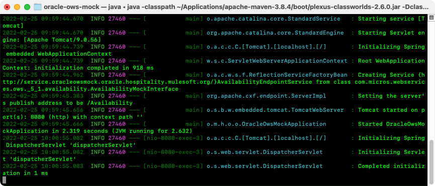
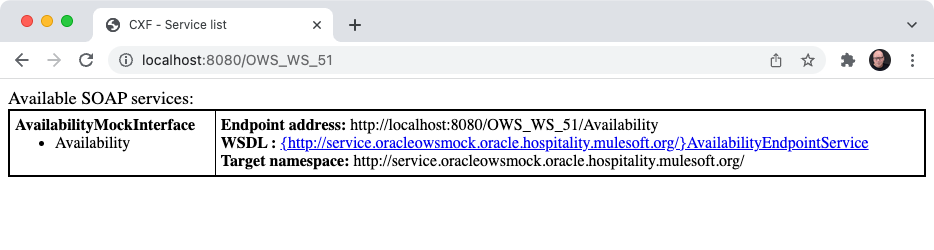
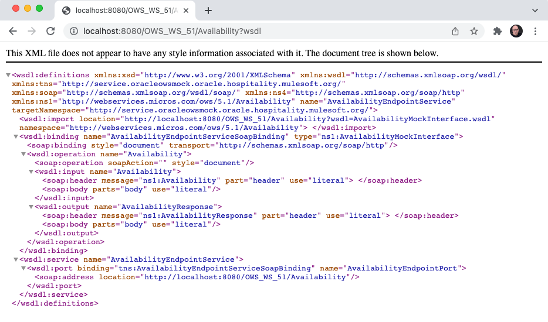

# Oracle OWS Mocking Web Service

This repository contains a mocking web service for simulating integrations with Oracle Hospitality's OPERA 5 Property Management System. 

> :memo: The current revision implements only one method, which simulates getting the general availability for the best available rates. 

## Table of Contents
1. [Implementation Overview](#implementation-overview)
2. [Instructions](#instructions)
3. [Sample Messages](#sample-messages)
4. [Reporting Issues](#reporting-issues)

## Implementation Overview
We implemented this mocking service using a top-down approach - i.e., starting with the WSDL and generating the Java stubs. We used the following technology stack:
- Java 11
- Spring Boot 2.6.3
- Apache CXF 3.5.0

The build creates a runnable JAR.

## Instructions
1. Download this repo or clone it.
    ```sh
    git clone https://github.com/abelisle-mulesoft/oracle-ows-mock.git
    ```
2. Open a command or shell window and change directory to the root of the project.  
3. Optionally, compile this project as a smoke test.
   1. On Linux or macOS:
       ```sh
       ./mvnw clean compile
       ```
   2. On Windows:
       ```sh 
       mvnw.cmd clean compile
       ```
4. Run the project
   1. On Linux or macOS:
       ```sh
       ./mvnw spring-boot:run
       ```
   2. On Windows:
       ```sh 
       mvnw.cmd spring-boot:run
       ```
      

5. Optionally, open http://localhost:8001/OWS_WS_51 to view all the endpoints available.



6. Optionally, open http://localhost:8001/OWS_WS_51/Availability?wsdl to view the WSDL.




## Sample Messages
Although this web service is a mockup, the current revision still expects a valid XML request. The following sample request message works well. 
```xml
<?xml version="1.0" encoding="utf-8"?>
<soapenv:Envelope
    xmlns:soapenv="http://schemas.xmlsoap.org/soap/envelope/"
    xmlns:ava="http://webservices.micros.com/og/4.3/Availability/">
    <soapenv:Header>
        <OGHeader
            transactionID="000032" primaryLangID="E"
            timeStamp="2022-02-25T09:55:16.3618750-05:00"
            xmlns="http://webservices.micros.com/og/4.3/Core/">
            <Origin entityID="WEST" systemType="WEB"/>
            <Destination entityID="TI" systemType="ORS"/>
        </OGHeader>
    </soapenv:Header>
    <soapenv:Body>
        <ava:AvailabilityRequest summaryOnly="true">
            <ava:AvailRequestSegment availReqType="Room" numberOfRooms="1" roomOccupancy="1"
                totalNumberOfGuests="1" totalNumberOfChildren="0">
                <ava:StayDateRange>
                    <ava:StartDate>2022-12-31T00:00:00.0000000-05:00</ava:StartDate>
                    <ava:EndDate>2023-01-02T00:00:00.0000000-05:00</ava:EndDate>
                </ava:StayDateRange>
                <ava:RatePlanCandidates>
                    <ava:RatePlanCandidate ratePlanCode="DBR"/>
                </ava:RatePlanCandidates>
                <ava:HotelSearchCriteria>
                    <ava:Criterion>
                        <ava:HotelRef chainCode="WC" hotelCode="SEFIVE"/>
                    </ava:Criterion>
                </ava:HotelSearchCriteria>
            </ava:AvailRequestSegment>
        </ava:AvailabilityRequest>
    </soapenv:Body>
</soapenv:Envelope>
```
> :memo: The current revision of this mocking web service ignores the request message's content. Furthermore, the SOAP headers are optional.

In the current revision, we hardcoded the response as follow:
```xml
<?xml version="1.0" encoding="UTF-8"?>
<avail:AvailabilityResponse
    xmlns:avail="http://webservices.micros.com/og/4.3/Availability/"
    summaryOnly="true" alternateDatesSpecified="false">
    <avail:Result resultStatusFlag="SUCCESS"/>
    <avail:AvailResponseSegments>
        <avail:AvailResponseSegment>
            <avail:RoomStayList>
                <avail:RoomStay>
                    <avail:RatePlans>
                        <avail:RatePlan ratePlanCode="BAR" hold="false" suppressRate="false" ratePlanName="BAR">
                            <avail:RatePlanDescription>
                                <avail:Text>Best Available Rate</avail:Text>
                            </avail:RatePlanDescription>
                            <avail:AdditionalDetails>
                                <avail:AdditionalDetail detailType="MarketingInformation">
                                    <avail:AdditionalDetailDescription>
                                        <avail:Text>Thank you for List Booking with WEST-SEFIVE</avail:Text>
                                    </avail:AdditionalDetailDescription>
                                </avail:AdditionalDetail>
                                <avail:AdditionalDetail detailType="CommissionPolicy">
                                    <avail:AdditionalDetailDescription>
                                        <avail:Text>No commission available</avail:Text>
                                    </avail:AdditionalDetailDescription>
                                </avail:AdditionalDetail>
                                <avail:AdditionalDetail detailType="TaxInformation">
                                    <avail:AdditionalDetailDescription>
                                        <avail:Text>Accommodation </avail:Text>
                                    </avail:AdditionalDetailDescription>
                                </avail:AdditionalDetail>
                            </avail:AdditionalDetails>
                            <avail:CancellationDateTime period="P2DT17H15M">2022-12-30T16:00:00</avail:CancellationDateTime>
                        </avail:RatePlan>
                    </avail:RatePlans>
                    <avail:RoomTypes>
                        <avail:RoomType roomTypeCode="AST" numberOfUnits="1">
                            <avail:RoomTypeDescription>
                                <avail:Text>Superior Deluxe Room</avail:Text>
                            </avail:RoomTypeDescription>
                        </avail:RoomType>
                        <avail:RoomType roomTypeCode="STK" numberOfUnits="24">
                            <avail:RoomTypeDescription>
                                <avail:Text>Standard King</avail:Text>
                            </avail:RoomTypeDescription>
                        </avail:RoomType>
                        <avail:RoomType roomTypeCode="KNG" numberOfUnits="20" roomTypeName="King">
                            <avail:RoomTypeDescription>
                                <avail:Text>This is a King NS room with balcony</avail:Text>
                            </avail:RoomTypeDescription>
                            <avail:RoomTypeShortDescription>
                                <avail:Text>King NS room.</avail:Text>
                            </avail:RoomTypeShortDescription>
                        </avail:RoomType>
                    </avail:RoomTypes>
                    <avail:RoomRates>
                        <avail:RoomRate roomTypeCode="AST" ratePlanCode="BAR" suppressRate="false">
                            <avail:Rates>
                                <avail:Rate rateOccurrence="DAILY" rateChangeIndicator="false">
                                    <avail:Base currencyCode="USD" decimals="2">149</avail:Base>
                                </avail:Rate>
                            </avail:Rates>
                            <avail:Total currencyCode="USD" decimals="2">149</avail:Total>
                        </avail:RoomRate>
                        <avail:RoomRate roomTypeCode="STK" ratePlanCode="BAR" suppressRate="false">
                            <avail:Rates>
                                <avail:Rate rateOccurrence="DAILY" rateChangeIndicator="false">
                                    <avail:Base currencyCode="USD" decimals="2">149</avail:Base>
                                </avail:Rate>
                            </avail:Rates>
                            <avail:Total currencyCode="USD" decimals="2">149</avail:Total>
                        </avail:RoomRate>
                        <avail:RoomRate roomTypeCode="KNG" ratePlanCode="BAR" suppressRate="false">
                            <avail:Rates>
                                <avail:Rate rateOccurrence="DAILY" rateChangeIndicator="false">
                                    <avail:Base currencyCode="USD" decimals="2">149</avail:Base>
                                </avail:Rate>
                            </avail:Rates>
                            <avail:Total currencyCode="USD" decimals="2">149</avail:Total>
                        </avail:RoomRate>
                    </avail:RoomRates>
                    <avail:HotelReference chainCode="WC" hotelCode="SEFIVE">Opera Demo Hotel, Medium</avail:HotelReference>
                    <avail:HotelContact>
                        <avail:Addresses>
                            <avail:Address>
                                <avail:AddressLine>1111 Street.</avail:AddressLine>
                                <avail:cityName>Anytown</avail:cityName>
                                <avail:stateProv>FL</avail:stateProv>
                                <avail:countryCode>US</avail:countryCode>
                                <avail:postalCode>99999</avail:postalCode>
                            </avail:Address>
                        </avail:Addresses>
                        <avail:ContactPhones>
                            <avail:Phone phoneType="FAX">
                                <avail:PhoneNumber>123-555-4321</avail:PhoneNumber>
                            </avail:Phone>
                            <avail:Phone phoneType="VOICE">
                                <avail:PhoneNumber>123-555-4321</avail:PhoneNumber>
                            </avail:Phone>
                        </avail:ContactPhones>
                        <avail:HotelInformation>
                            <avail:HotelInfo hotelInfoType="CHECKININFO">
                                <avail:Text>
                                    <avail:TextElement>09:15</avail:TextElement>
                                </avail:Text>
                            </avail:HotelInfo>
                            <avail:HotelInfo hotelInfoType="CHECKOUTINFO">
                                <avail:Text>
                                    <avail:TextElement>08:00</avail:TextElement>
                                </avail:Text>
                            </avail:HotelInfo>
                        </avail:HotelInformation>
                    </avail:HotelContact>
                </avail:RoomStay>
            </avail:RoomStayList>
        </avail:AvailResponseSegment>
    </avail:AvailResponseSegments>
</avail:AvailabilityResponse>
```
> :memo: You can find and optionally modify the SOAP body of the default response by editing the file [src/main/resources/messages/GeneralAvailabilityResponseBestAvailable.xml](src/main/resources/messages/GeneralAvailabilityResponseBestAvailable.xml). 


## Reporting Issues

You can report new issues at this link [https://github.com/abelisle-mulesoft/oracle-ows-mock/issues](https://github.com/abelisle-mulesoft/oracle-ows-mock/issues).
